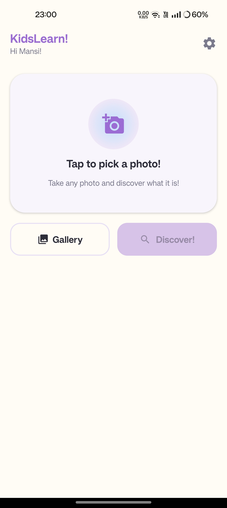
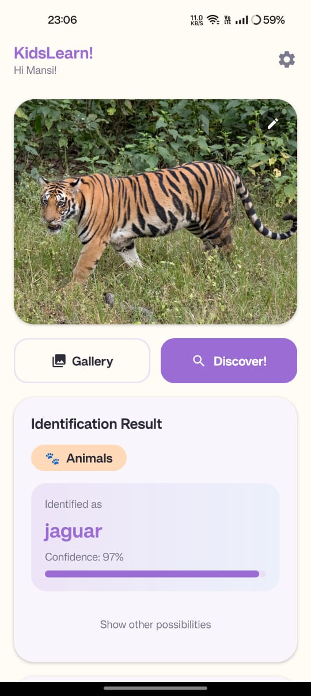
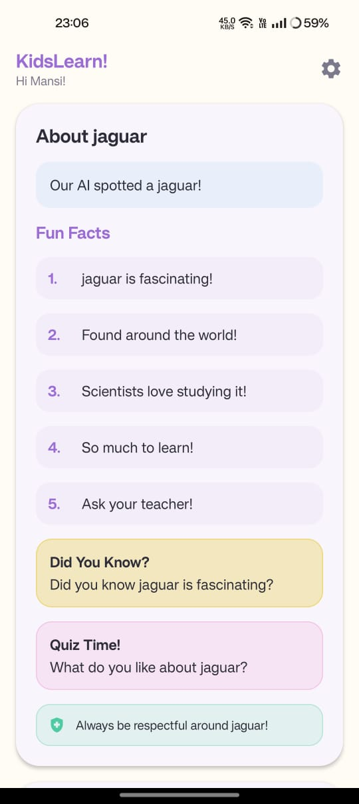

# 🔍 Image Classification App

An Android application that performs **real-time image classification** using on-device machine learning.

---

## 📸 Screenshots

  
  
  

---

## ✨ Features

- 📷 Capture image from camera or pick from gallery
- ⚡ Real-time classification using **TensorFlow Lite** (on-device, offline)
- 📊 Displays top predictions with **confidence scores**
- 🎨 Clean and minimal UI built with **Jetpack Compose**

---

## 🛠️ Tech Stack

| Technology | Usage |
|---|---|
| Kotlin | Primary language |
| Jetpack Compose | UI framework |
| TensorFlow Lite | On-device ML model |
| CameraX | Camera integration |
| Android SDK | Platform |

---
